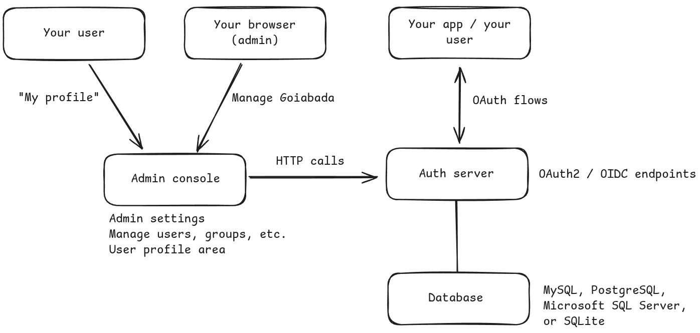

# Getting started

## Overview of Goiabada architecture

Goiabada is made up of three main parts:

- the auth server, which manages key endpoints for authorization, token exchange, and authentication forms; 
- the admin console, where you can change settings and manage user accounts and profiles;
- and lastly, a database that's used by both.



## How to run it?

The easiest and recommended way to use Goiabada is through containers, with images available on [docker hub](https://hub.docker.com/repository/docker/leodip/goiabada).

You can also find pre-built binaries on the [releases](https://github.com/leodip/goiabada/releases) page of github if you prefer to work without containers.

### I just want to test it locally

Ok, let's use HTTP only. (never do this in production!)

Save this [docker compose file](https://github.com/leodip/goiabada/tree/main/src/docker/docker-compose-mysql.yml) and do:

```
docker compose -f docker-compose-mysql.yml up -d
```

If you want to test it with sqlite you can use this [docker compose file](https://github.com/leodip/goiabada/tree/main/src/docker/docker-compose-sqlite.yml) instead. 

```
docker compose -f docker-compose-sqlite.yml up -d
```

For more details on environment variables, check [here](config.md).

### I want to deploy and expose it directly to the internet without a reverse proxy

To deploy and expose Goiabada directly to the internet, you'll need to configure both HTTPS (for external access) and HTTP (for internal communication).

Do not expose the HTTP port to the internet, only the HTTPS. Keep the HTTP port restricted to internal use.

When starting two web applications (`authserver` and `adminconsole`) on the same server, it's not possible for both apps to listen on port 443 simultaneously. You can set one application to listen on port 443 and assign a different port to the other.

To make this work you'll also need SSL certificates. If you don't have them, you can generate free SSL certificates using Let's Encrypt ([see example](https://www.digitalocean.com/community/tutorials/how-to-secure-apache-with-let-s-encrypt-on-ubuntu)).

Use this [docker compose file](https://github.com/leodip/goiabada/tree/main/src/docker/docker-compose-direct.yml) as a starting point.

### I want to deploy and have Goiabada behind a reverse proxy

Using a reverse proxy (like Nginx) offers some advantages when deploying Goiabada. It allows both the `authserver` and `adminconsole` applications to share port 443.

In this setup you should make Goiabada use HTTP only, and let the reverse proxy handle the HTTPS.

Use this [docker compose file](https://github.com/leodip/goiabada/tree/main/src/docker/docker-compose-reverse-proxy.yml) as a starting point.

Here's an example of Nginx configuration:

```nginx
# /etc/nginx/conf.d/demo-goiabada.conf

# Auth Server
server {
    listen 443 ssl http2;
    listen [::]:443 ssl http2;
    server_name demo-authserver.goiabada.dev;

    # SSL configuration
    ssl_certificate /etc/letsencrypt/live/demo-authserver.goiabada.dev/fullchain.pem;
    ssl_certificate_key /etc/letsencrypt/live/demo-authserver.goiabada.dev/privkey.pem;
    
    # SSL parameters
    ssl_protocols TLSv1.2 TLSv1.3;
    ssl_ciphers HIGH:!aNULL:!MD5;
    ssl_prefer_server_ciphers on;
    
    # Security headers
    add_header Strict-Transport-Security "max-age=31536000; includeSubDomains" always;
    add_header X-Frame-Options "SAMEORIGIN" always;
    add_header X-Content-Type-Options "nosniff" always;

    location / {
        proxy_pass http://127.0.0.1:9090;
        proxy_set_header Host $host;
        proxy_set_header X-Real-IP $remote_addr;
        proxy_set_header X-Forwarded-For $proxy_add_x_forwarded_for;
        proxy_set_header X-Forwarded-Proto $scheme;
    }
}

# Admin Console
server {
    listen 443 ssl http2;
    listen [::]:443 ssl http2;
    server_name demo-adminconsole.goiabada.dev;

    # SSL configuration
    ssl_certificate /etc/letsencrypt/live/demo-adminconsole.goiabada.dev/fullchain.pem;
    ssl_certificate_key /etc/letsencrypt/live/demo-adminconsole.goiabada.dev/privkey.pem;
    
    # SSL parameters
    ssl_protocols TLSv1.2 TLSv1.3;
    ssl_ciphers HIGH:!aNULL:!MD5;
    ssl_prefer_server_ciphers on;
    
    # Security headers
    add_header Strict-Transport-Security "max-age=31536000; includeSubDomains" always;
    add_header X-Frame-Options "SAMEORIGIN" always;
    add_header X-Content-Type-Options "nosniff" always;

    location / {
        proxy_pass http://127.0.0.1:9091;
        proxy_set_header Host $host;
        proxy_set_header X-Real-IP $remote_addr;
        proxy_set_header X-Forwarded-For $proxy_add_x_forwarded_for;
        proxy_set_header X-Forwarded-Proto $scheme;
    }
}

# HTTP redirect to HTTPS
server {
    listen 80;
    listen [::]:80;
    server_name demo-authserver.goiabada.dev demo-adminconsole.goiabada.dev;
    
    location / {
        return 301 https://$host$request_uri;
    }
}
```

## First login

Once the containers are up and running, you can access the admin console at the URL configured. 

The admin credentials are either what you've set in the environment variables, or by default:

```text
Email: admin@example.com
Password: changeme
```

## Trust reverse proxy headers and secure cookie

If you're using a reverse proxy, you should trust the headers sent by it. Make sure these are `true`:

```
GOIABADA_AUTHSERVER_TRUST_PROXY_HEADERS=true
GOIABADA_ADMINCONSOLE_TRUST_PROXY_HEADERS=true
```

The `True-Client-IP`, `X-Real-IP` or the `X-Forwarded-For` header will be used to get the client's IP address.

If you're not using a reverse proxy, you should set those variables to `false`.

Also, this should always be set to `true` in production, when using HTTPS:

```
GOIABADA_AUTHSERVER_SET_COOKIE_SECURE=true
GOIABADA_ADMINCONSOLE_SET_COOKIE_SECURE=true
```

The only scenario where they should be `false` is when testing locally with HTTP only.
