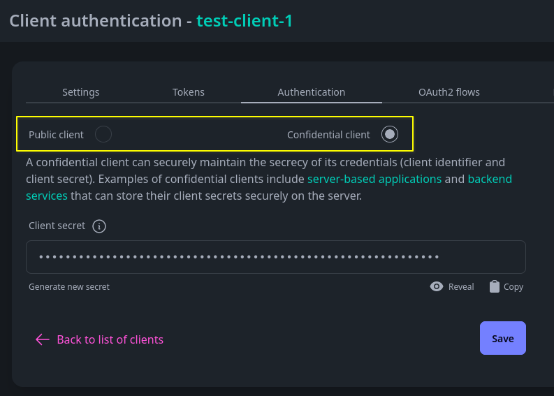
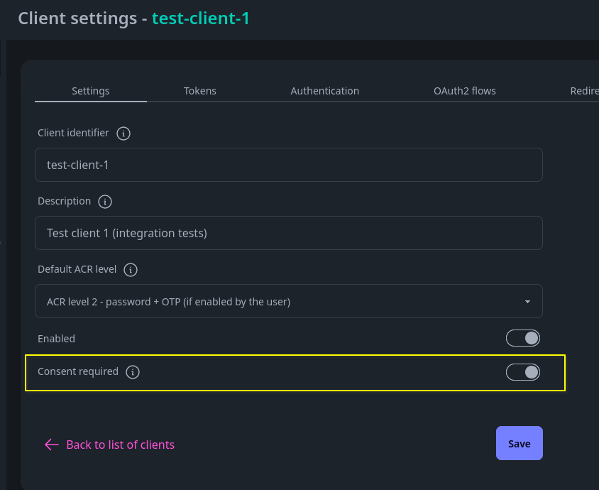
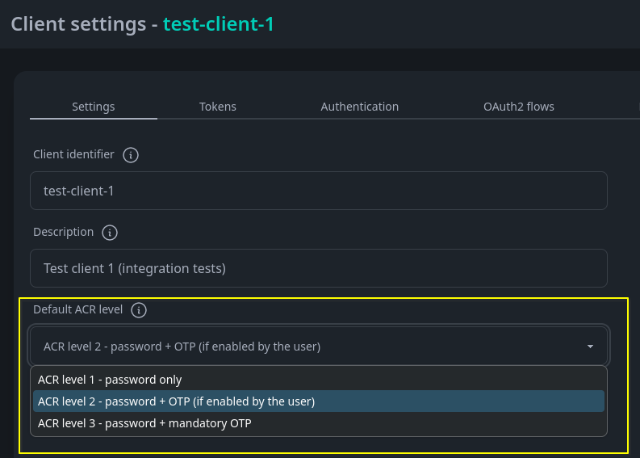
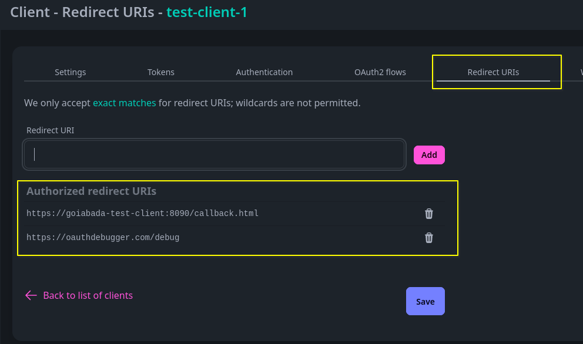
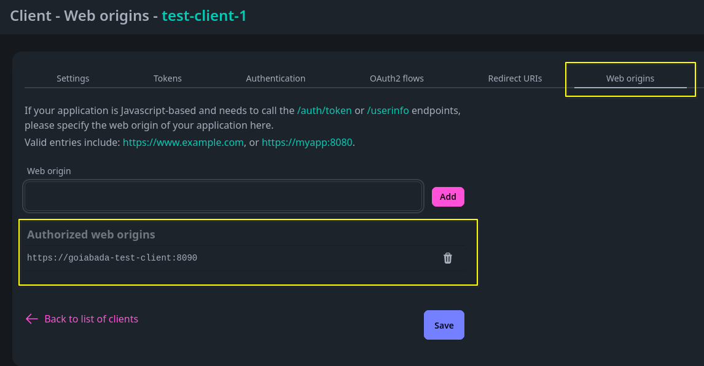
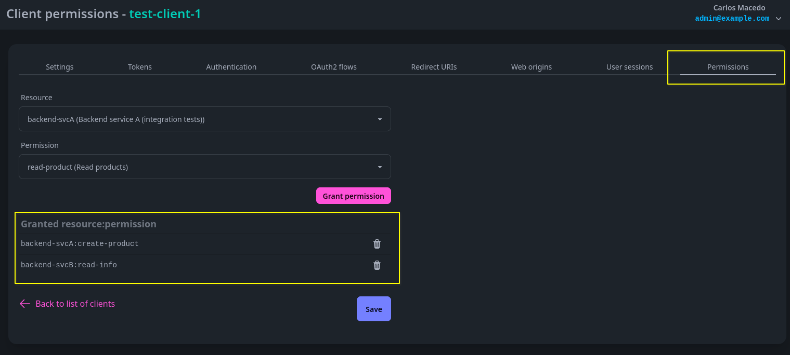

# How it works

## Use cases

Goiabada comes in handy in two main situations:

1. When you have users who need to access a resource (an area of your application, or an API)
2. When you have a server that wants to access another server securely

Let's view those in more details.

### Users accessing resources

When you have users accessing resources, you basically need to know: who is the user (*authentication*), and if they're allowed to access that resource (*authorization*).

Goiabada works with two familiar web protocols to fulfil that: OpenID Connect handles the who's who (*authentication*), and OAuth2 takes care of who can do what (*authorization*).

When users are accessing resources, no matter what type of app you may have (like a web app on the server side, a web app using JavaScript, or a mobile native app), the recommended way to go is the **Authorization code flow with PKCE**.

The Authorization code flow with PKCE is a secure method for user authentication in web applications. It involves a two-step process: first, the application requests an authorization code in the `/authorize` endpoint, and then it exchanges this code for an access token, a refresh token, and optionally an id token, using the `/token` endpoint.

PKCE adds an extra layer of security by preventing interception of the authorization code, particularly in public clients like mobile or single-page applications.

### Server to server communications

When you have a set of servers working together, and you want to ensure that only the right clients can access resources on a specific server, go for the **Client credentials flow**, with a confidential client.

### Learn more about OAuth2

OAuth2 covers a lot of ground. To delve deeper into it, check out this link - [https://www.oauth.com/](https://www.oauth.com/)

## Clients

A clients represents an application that requests access to protected resources.

This access can be on behalf of a user (in authorization code flow with PKCE), or for the client itself (in client credentials flow).

### Public or confidential clients

Clients can be public or confidential.

A **public client** is recommended for applications that cannot ensure the confidentiality of their client credentials. This is relevant for JavaScript-only web applications, where keeping a password confidential in JavaScript is not feasible due to its visibility. The same consideration applies to mobile apps, as an APK package can be downloaded and decompiled, exposing any secrets stored within.

A **confidential client** is recommended for applications that can securely maintain the confidentiality of their client credentials. This applies to server-side applications, where the ability to protect and keep secrets confidential is feasible. In contrast to public clients, confidential clients, such as server-side web applications, can safely store sensitive information like passwords without exposing them to potential risks.

### Consent required

In OAuth2, the consent process is vital to ensuring users explicitly authorize third-party applications to access their resources.

Typically, when the client is affiliated with the same organization that owns the authorization server and a high level of trust exists, explicit consent may not be necessary.

However, in the case of a client from a third-party organization, it's crucial to configure the client to request user consent. This ensures users are informed about who is utilizing their tokens, promoting transparency and user awareness.

### Default ACR level

ACR stands for "Authentication Context Class Reference." It's a way to specify the level of authentication assurance or the strength of the authentication method used to authenticate the end-user.

Goiabada has 3 levels:

| ACR level | Description |
| --------- | ----------- |
| `urn:goiabada:pwd` | Password only |
| `urn:goiabada:pwd:otp_ifpossible` | Password with 2fa OTP (if enabled) |
| `urn:goiabada:pwd:otp_mandatory` | Password with mandatory 2fa OTP |

By default, a client comes configured with `urn:goiabada:pwd:otp_ifpossible`.

You have the flexibility to override the client's default ACR level on a per-authorization basis. For instance, if you have a specific resource that requires users to authenticate using a two-factor authentication (2FA) one-time password (OTP), you can specify `urn:goiabada:pwd:otp_mandatory` in the `acr_values` parameter of the authorization request.

### Redirect URIs

In the Authorization code flow with PKCE, the client application specifies a redirect URI in its authorization request.

After the user grants or denies permission, the authorization server redirects the user back to this specified URI.

It's necessary to pre-configure this URI in the client, and only exact matches are accepted (no wildcards are allowed). This helps ensure the security of the authorization process.

### Web origins

If your client application plans to make calls to the `/token` or `/userinfo` endpoints from Javascript, you must register the URL (origin) of the web application here, to enable Cross-Origin Resource Sharing (CORS) access. Failure to do so will result in CORS blocking the HTTP requests.

### Client permissions

Client permissions become relevant in server-to-server exchanges, specifically within the client credentials flow. This is about the permissions granted to the client itself, allowing it to access other resources.

## Resources and permissions

In Goiabada, you have the ability to define both resources and permissions. Each resource can have multiple permissions associated with it. Subsequently, you can assign these permissions to users, groups, or clients as needed.

### Scope

When you pair a resource with a permission, it forms a **scope**, both in the authorization request and within the tokens. For example, if you have a resource identified as `product-api` and a permission identified as `delete-product` the corresponding scope will be represented as `product-api:delete-product`.

## OpenID Connect scopes

Besides the normal authorization scope explained earlier, Goiabada supports typical OpenID Connect scopes. They are:

| OIDC scope | Description |
| --------- | ----------- |
| openid | Will include an **id token** in the token response, with the subject identifier (sub claim) |
| profile | Access to claims: name, family_name, given_name, middle_name, nickname, preferred_username, profile, website, gender, birthdate, zoneinfo, locale, and updated_at |
| email | Access to claims: email, email_verified |
| address | Access to the address claim |
| phone | Access to claims: phone_number and phone_number_verified |
| groups | Access to the list of groups the user belongs to |
| attributes | Access to the attributes assigned to the user by an admin, stored as key-value pairs |
| offline_access | Access to a refresh token of the type 'Offline', allowing the client to obtain a new access token without requiring an immediate interaction |

## Users and groups

## Refresh tokens

## Self registration

