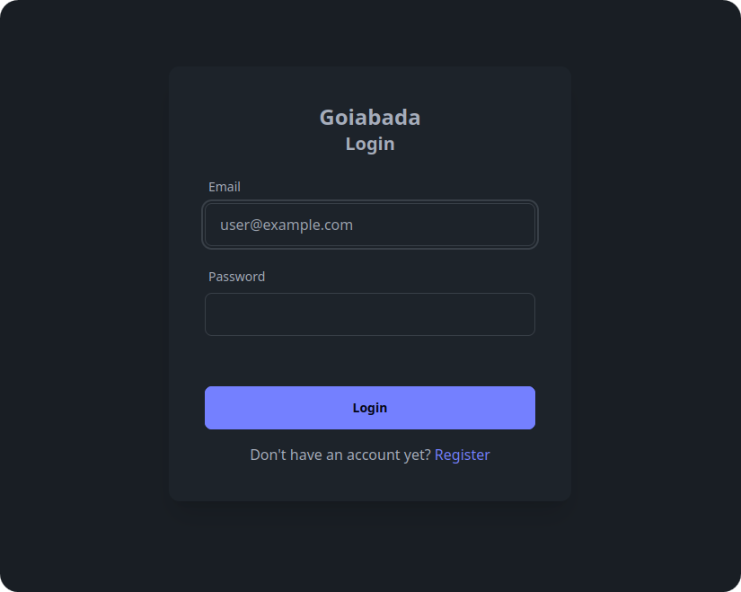
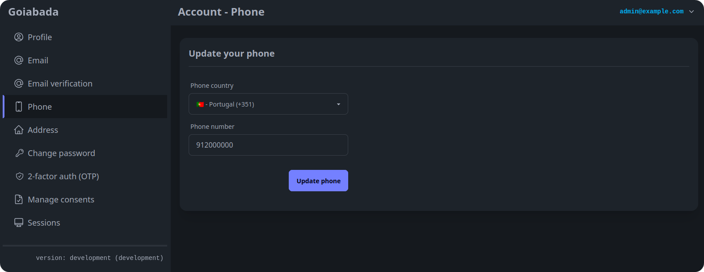
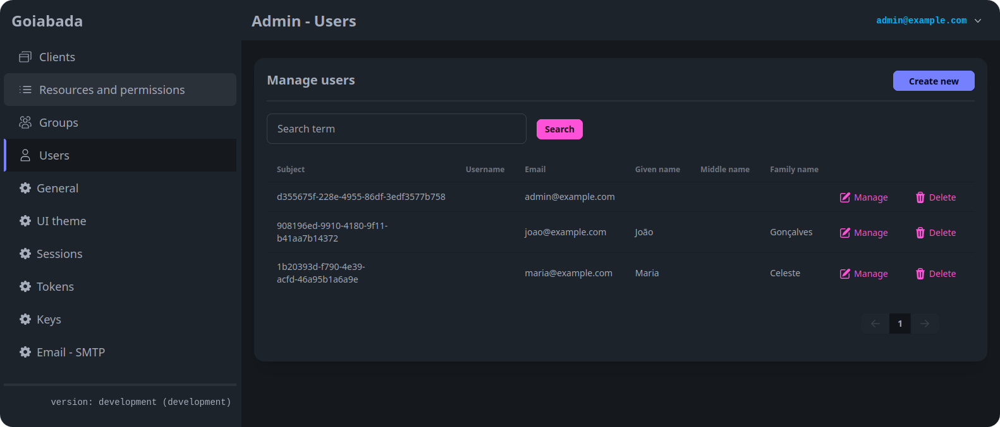

# Welcome to Goiabada

Goiabada is an open-source **authentication** and **authorization** server. 

Goiabada makes user management easy for app developers. You can set up users, groups, resources, and permissions to integrate with your software. Plus, it handles authentication and authorization for server-to-server connections too.

- Built with Go for speed and low resource usage
- Easy-to-use interface
- Supports Single Sign-On (SSO)
- Two-factor authentication (2FA) with one-time passwords (OTP)
- Fine-tuned control over resources and permissions
- Self-service account page for users to update their details
- OAuth2 support, including authorization code flow and client credentials flow
- OpenID Connect support
- Compatible with MySQL and SQLite databases (other DBs coming soon)

# Important ⚠️

Goiabada is currently in the **pre-release** stage, nearing its first official release. We don't anticipate any breaking changes from this point forward, unless absolutely necessary.

## Screenshots

