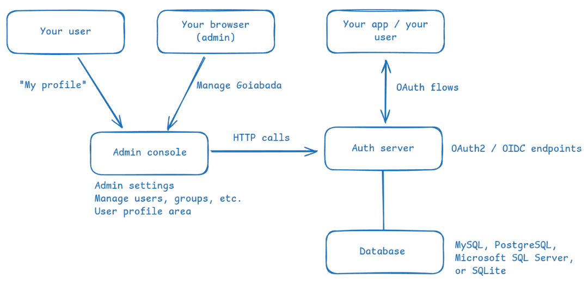

import { CardGrid, LinkCard } from '@astrojs/starlight/components';

Goiabada is an open-source server that signs your users in, so your apps don't have to.

You run it yourself. Your apps send users to Goiabada to sign in, and get back tokens that say who the user is and what they're allowed to do. Goiabada speaks OAuth2 and OpenID Connect, the standards almost every language and framework already has a library for.

## What it does

- **Sign-in with passwords and two-factor authentication.** Users sign in with a password, and optionally a code from an authenticator app. Each app chooses whether a code is required. See [Require two-factor authentication](/guides/require-two-factor-authentication/).
- **Single sign-on.** Users sign in once and can use all your apps without signing in again. See [Single sign-on across clients](/guides/single-sign-on-across-clients/).
- **Permissions.** You decide who can do what in your APIs, with resources, permissions and groups. See [Resources and permissions](/concepts/resources-and-permissions/).
- **API protection.** Apps and services get tokens for calling your APIs, with or without a user. See [Protect an API](/guides/protect-an-api/).
- **Self-service accounts.** Users update their own profile, email, password and two-factor authentication.
- **Dynamic client registration.** Apps such as MCP clients can register themselves, when you turn it on. See [Let clients register themselves (DCR)](/guides/let-clients-register-themselves-dcr/).
- **An audit log.** Sign-ins, failed passwords and every change an administrator makes are recorded. See [Audit log](/concepts/audit-log/).

## How it works

Goiabada has three parts:

- The **auth server** signs users in and issues tokens. It serves the OAuth2 and OpenID Connect endpoints, the sign-in pages, and an API for managing everything.
- The **admin console** is the web app where you manage clients, users, groups, permissions and settings, and where users manage their own account. It's a client of the auth server and talks to it over HTTP.
- The **database** holds everything: MySQL, PostgreSQL, SQL Server or SQLite. Only the auth server connects to it.

Both servers are written in Go, and each ships as a Docker image and a native binary for Linux, macOS and Windows.

If OAuth2 and OpenID Connect are new to you, the [glossary](/concepts/glossary/) explains each term in plain English.

## Docs for AI agents

These docs are also published as plain text, for AI agents and tools that read documentation:

- [`/llms.txt`](/llms.txt) lists every page, with its title, URL and a one-line description.
- [`/llms-full.txt`](/llms-full.txt) holds every page in full, as Markdown, in one file.

## Next steps

<CardGrid>
  <LinkCard title="Quickstart" description="Run Goiabada on your machine in a few minutes." href="/get-started/quickstart/" />
  <LinkCard title="Setup wizard" description="Generate the configuration for a real deployment." href="/get-started/setup-wizard/" />
</CardGrid>
