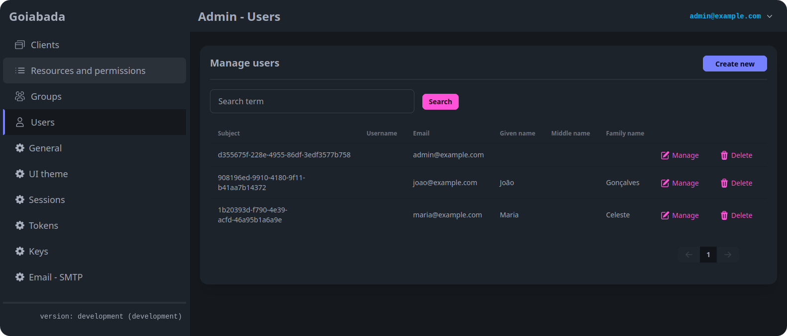

import { Card, CardGrid, LinkCard } from '@astrojs/starlight/components';

## What does Goiabada do?

If you're building applications and need to handle user logins, manage permissions, or enable users to sign in across multiple apps with one account, Goiabada takes care of this for you. Instead of building authentication from scratch, you can integrate Goiabada and focus on what makes your application unique.

Goiabada handles:

- **User authentication** - Secure login with passwords and two-factor authentication
- **Authorization** - Control who can access what in your applications
- **Single sign-on (SSO)** - Let users log in once and access multiple apps
- **API security** - Protect server-to-server communications
- **User self-service** - Give users control over their own profiles and security settings

## Who is Goiabada for?

- **Developers** building web or mobile apps who need authentication
- **Teams** wanting to centralize user management across multiple applications
- **Organizations** that need to self-host their identity provider for security or compliance
- **Anyone** who wants an alternative to proprietary services like Auth0, Keycloak or cloud-only solutions

## Key features

<CardGrid stagger>
  <Card title="OAuth2 & OpenID Connect" icon="approve-check">
    Industry-standard protocols. Compatibility with your existing tools.
  </Card>
  <Card title="Single sign-on (SSO)" icon="rocket">
    One login for all your connected applications. Users authenticate once and access multiple apps seamlessly.
  </Card>
  <Card title="Two-factor & step-up auth" icon="approve-check-circle">
    Extra security with one-time passwords (OTP). Step-up authentication for sensitive operations.
  </Card>
  <Card title="Fine-grained permissions" icon="setting">
    Define exactly who can access what in your applications.
  </Card>
  <Card title="Self-service account management" icon="pencil">
    Users can update their own profiles, change passwords, and manage their security settings.
  </Card>  
  <Card title="Dynamic client registration" icon="add-document">
    Apps can self-register via RFC 7591. Useful for MCP servers and native applications.
  </Card>
  <Card title="Multiple database support" icon="laptop">
    Choose your database: MySQL, PostgreSQL, Microsoft SQL Server, or SQLite.
  </Card>
  <Card title="Built with Go" icon="seti:go">
    Fast, lightweight, and resource-efficient. Low resource usage means lower hosting costs.
  </Card>
  <Card title="Multi-architecture Docker images" icon="linux">
    Run on Intel/AMD (x86_64) or ARM64 (Raspberry Pi, Apple Silicon, AWS Graviton).
  </Card>
</CardGrid>

## Why choose Goiabada?

- **Self-hosted & private** - Keep full control of your user data and infrastructure. Your data never leaves your servers.
- **Free & MIT licensed** - 100% free to use with no licensing fees, subscriptions, or vendor lock-in. Truly open source.
- **Lightweight** - Low resource usage means lower hosting costs
- **Standards-compliant** - Built on OAuth2 and OpenID Connect for maximum compatibility
- **Developer-friendly** - Quick to set up, easy to integrate

## Screenshots

