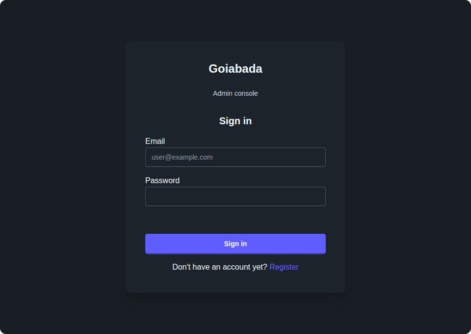

import { Card, CardGrid, LinkCard } from '@astrojs/starlight/components';
import ImageZoom from '../../components/ImageZoom.astro';

Goiabada signs your users in, so your apps don't have to. It's an **OAuth2** and **OpenID Connect** server: your apps send users to it, and get back tokens that say who each user is and what they can do.

## What you get

<CardGrid stagger>
  <Card title="OAuth2 and OpenID Connect" icon="approve-check">
    The standards your languages and frameworks already have libraries for.
  </Card>
  <Card title="Single sign-on" icon="rocket">
    Users sign in once and use all your apps.
  </Card>
  <Card title="Two-factor authentication" icon="approve-check-circle">
    Codes from an authenticator app, required for the apps that need them.
  </Card>
  <Card title="Permissions" icon="setting">
    Decide who can do what in your APIs, by user, group or client.
  </Card>
  <Card title="Custom claims" icon="list-format">
    Add groups and your own user and group attributes to ID tokens, access tokens or both.
  </Card>
  <Card title="Self-service accounts" icon="pencil">
    Users manage their own profile, picture, email, phone, address, password and two-factor authentication, end their sessions and revoke consents.
  </Card>
  <Card title="Self-registration and password recovery" icon="email">
    People create their own accounts, with or without email verification, and reset a forgotten password.
  </Card>
  <Card title="Dynamic client registration" icon="add-document">
    Apps such as MCP clients register themselves, when you turn it on.
  </Card>
  <Card title="Admin API" icon="puzzle">
    Script everything the admin console does, with an OpenAPI reference and permissions as narrow as read-only.
  </Card>
  <Card title="Audit log" icon="notes">
    Sign-ins, failed passwords and every change an administrator makes, recorded and shown in the admin console.
  </Card>
  <Card title="Your choice of database" icon="laptop">
    MySQL, PostgreSQL, SQL Server or SQLite.
  </Card>
  <Card title="Light to run" icon="seti:go">
    Two small Go servers, as Docker images for x86_64 and ARM64, or as native binaries.
  </Card>
  <Card title="Setup wizard" icon="seti:shell">
    Answer a few questions and get a ready-to-run setup for Docker Compose, Kubernetes or native binaries, keys and passwords included.
  </Card>
  <Card title="Kubernetes friendly" icon="server">
    Generated manifests with probes, graceful shutdown and disruption budgets, Prometheus metrics, and servers that scale out to several replicas.
  </Card>
</CardGrid>

## Why Goiabada

- **Your data stays with you.** You host it, so your users' data lives on your servers.
- **Free and open source.** MIT licensed, with no fees or subscriptions.
- **Standard.** Anything that speaks OAuth2 or OpenID Connect works with it.

## Have a look

<ImageZoom />

## Docs for AI agents

These docs are also published as plain text, for AI agents and tools that read documentation:

- [`/llms.txt`](/llms.txt) lists every page, with its title, URL and a one-line description.
- [`/llms-full.txt`](/llms-full.txt) holds every page in full, as Markdown, in one file.

## Start here

<CardGrid>
  <LinkCard title="Quickstart" description="Run it on your machine in a few minutes." href="/get-started/quickstart/" />
  <LinkCard title="Add sign-in to a web app" description="Then let users of your web app sign in with it." href="/guides/add-sign-in-to-a-web-app/" />
</CardGrid>
