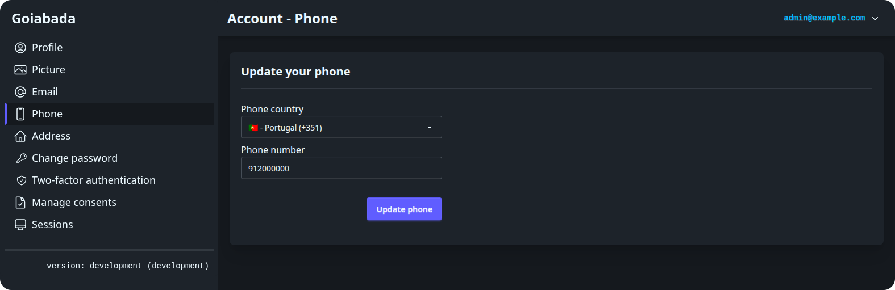
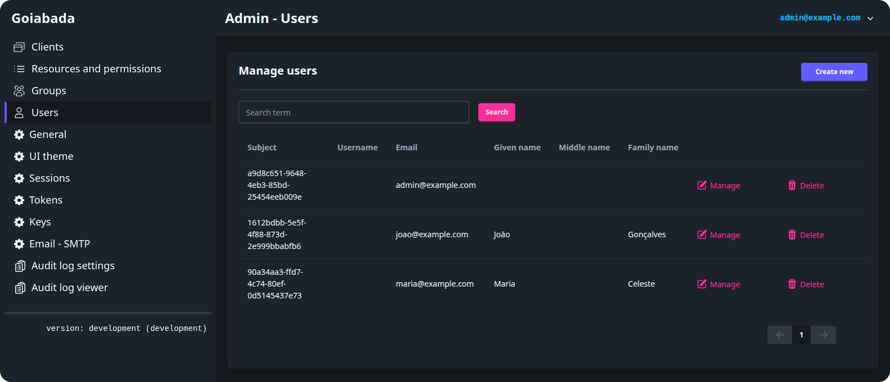

import { Card, CardGrid, LinkCard } from '@astrojs/starlight/components';

Goiabada signs your users in, so your apps don't have to. It's an OAuth2 and OpenID Connect server: your apps send users to it, and get back tokens that say who each user is and what they can do.

## What you get

<CardGrid stagger>
  <Card title="OAuth2 and OpenID Connect" icon="approve-check">
    The standards your languages and frameworks already have libraries for.
  </Card>
  <Card title="Single sign-on" icon="rocket">
    Users sign in once and use all your apps.
  </Card>
  <Card title="Two-factor authentication" icon="approve-check-circle">
    Codes from an authenticator app, required for the apps that need them.
  </Card>
  <Card title="Permissions" icon="setting">
    Decide who can do what in your APIs, by user, group or client.
  </Card>
  <Card title="Self-service accounts" icon="pencil">
    Users manage their own profile, password and two-factor authentication.
  </Card>
  <Card title="Dynamic client registration" icon="add-document">
    Apps such as MCP clients register themselves, when you turn it on.
  </Card>
  <Card title="Your choice of database" icon="laptop">
    MySQL, PostgreSQL, SQL Server or SQLite.
  </Card>
  <Card title="Light to run" icon="seti:go">
    Two small Go servers, as Docker images for x86_64 and ARM64, or as native binaries.
  </Card>
</CardGrid>

## Why Goiabada

- **Your data stays with you.** You host it, so your users' data lives on your servers.
- **Free and open source.** MIT licensed, with no fees or subscriptions.
- **Standard.** Anything that speaks OAuth2 or OpenID Connect works with it.

## Have a look

## Start here

<CardGrid>
  <LinkCard title="Introduction" description="What Goiabada is and how its parts fit together." href="/get-started/introduction/" />
  <LinkCard title="Quickstart" description="Run it on your machine in a few minutes." href="/get-started/quickstart/" />
</CardGrid>
